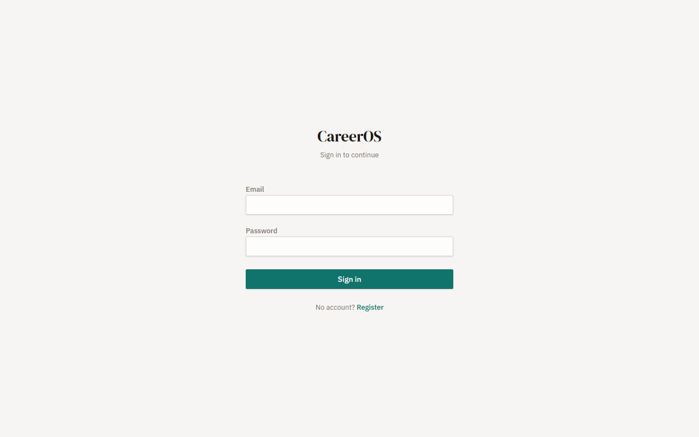
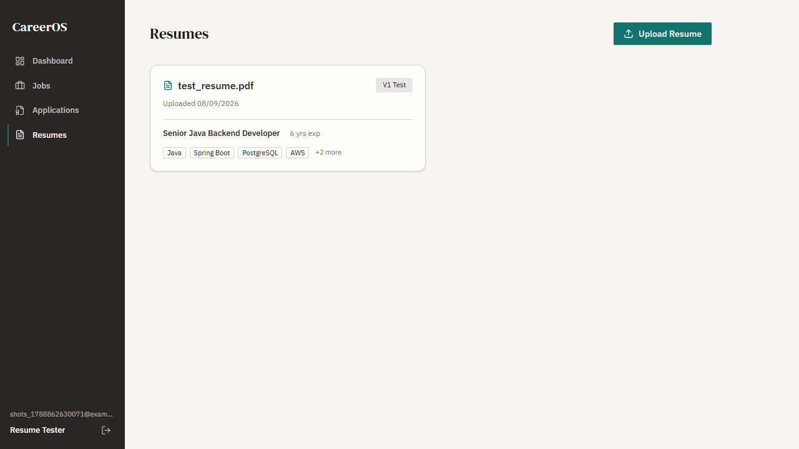
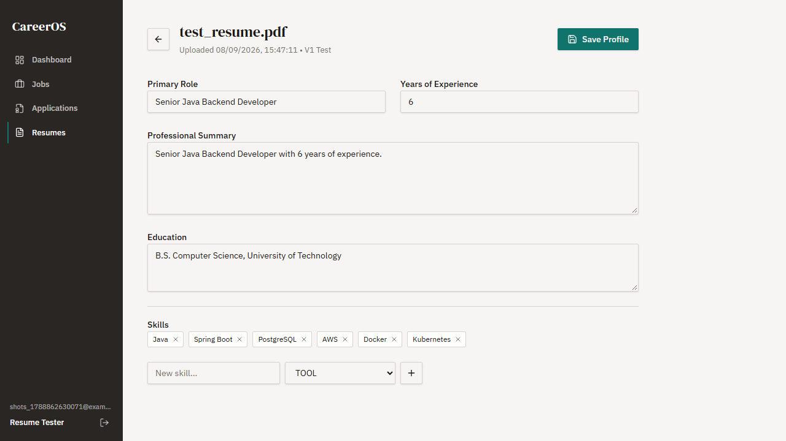
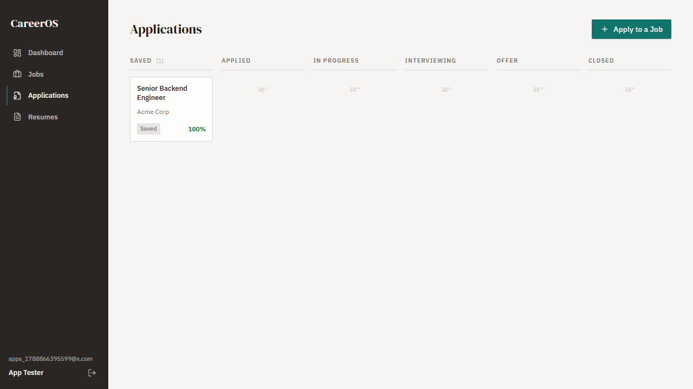
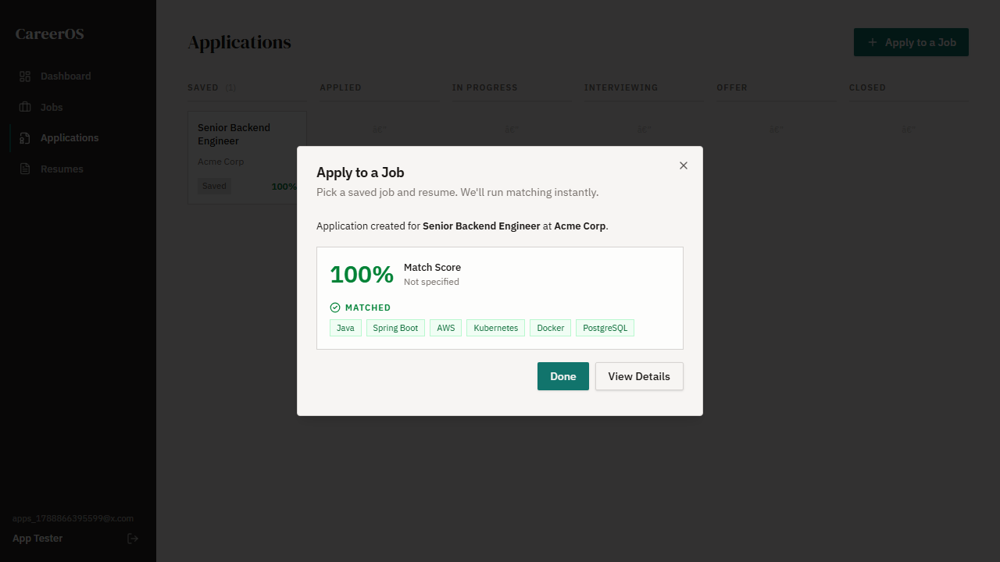
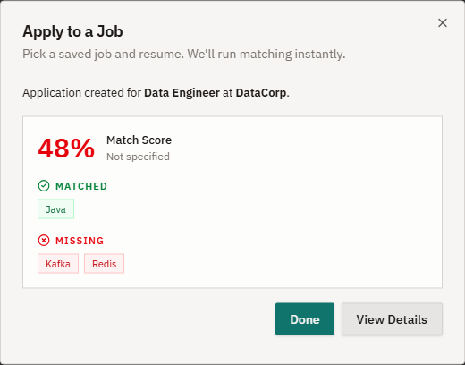

# CareerOS — AI-Powered Career & Job Application Management Platform

CareerOS is a full-stack **AI-powered career management platform** designed to help job seekers organize their job search, manage resumes, evaluate job compatibility, and track applications through a centralized dashboard.

The platform combines a **React + TypeScript frontend** with a **Java Spring Boot REST API**, **PostgreSQL**, **JWT-based authentication**, resume parsing, AI-assisted profile generation, job information extraction, and rule-based job matching.

---

## 🚀 Features

### 🔐 Authentication & Security

* User registration and login
* Password hashing with BCrypt
* JWT-based authentication
* Protected API endpoints
* Protected frontend routes
* User-specific jobs, resumes, and applications
* CORS configuration for frontend/backend communication

---

### 📄 Resume Management

CareerOS allows users to upload and manage multiple resume versions.

**Capabilities:**

* Upload PDF and DOCX resumes
* Extract text from uploaded resumes
* Store resume metadata and extracted content
* Generate a structured candidate profile using AI
* Extract:

  * Professional summary
  * Experience
  * Primary role
  * Education
  * Technical and professional skills
* Edit the generated candidate profile
* Maintain multiple resume versions
* View detailed resume information

AI processing is designed so that a failed AI request does not cause the resume upload itself to fail. The uploaded resume and extracted text remain available even when profile generation is unsuccessful.

---

### 💼 Job Management

CareerOS provides a centralized place to save and manage job opportunities.

**Capabilities:**

* Create and save job postings
* View saved jobs
* Store company information
* Store job description and requirements
* Track required and preferred skills
* Track experience requirements
* Specify work mode and other job attributes

#### 🔗 Job URL Import

Instead of manually entering every job detail, users can provide a job posting URL.

CareerOS attempts to:

1. Fetch the job page
2. Detect structured `JobPosting` information
3. Extract job details from JSON-LD when available
4. Fall back to cleaned page content when structured data is unavailable
5. Use AI-assisted structuring where required
6. Return the extracted information as a **draft**
7. Allow the user to review/edit the information before saving

The extracted job is not automatically persisted, giving the user control over the final information.

---

### 🎯 Resume–Job Match Scoring

CareerOS calculates a compatibility score between a candidate's resume profile and a saved job.

The matching system considers:

* Required skills
* Preferred skills
* Candidate experience
* Job experience requirements

The current scoring model uses:

```text
Skill Score     → 80% of overall score
Experience      → 20% of overall score
```

Within the skill score:

```text
Required Skills → 70%
Preferred Skills → 30%
```

The matching result includes:

* Overall score: `0–100`
* Matched skills
* Missing skills
* Experience assessment

This allows users to quickly identify how well their current profile aligns with a particular job.

---

### 📌 Application Tracking

CareerOS includes an application pipeline for tracking job applications from initial discovery through later stages.

Users can:

* Create applications
* Associate an application with a job
* Select the resume used for the application
* Store notes
* View application status
* Change application status
* View application history/timeline
* View the calculated match score

Every application status change is recorded as an event, creating an application timeline.

---

### 📊 Career Dashboard

The dashboard provides a high-level view of the user's job-search activity.

It includes:

* Active applications
* Total applications
* Interviews
* Offers
* Rejections
* Interview rate
* Offer rate
* Applications this week
* Applications this month

This provides a quick overview of the user's current job-search pipeline and progress.

---

## 🏗️ System Architecture

CareerOS follows a client-server architecture with a separate frontend and backend.

```text
                    ┌──────────────────────┐
                    │       User           │
                    └──────────┬───────────┘
                               │
                               ▼
                    ┌──────────────────────┐
                    │ React + TypeScript   │
                    │      Frontend        │
                    │       Vite           │
                    └──────────┬───────────┘
                               │
                         REST / JSON
                               │
                               ▼
                    ┌──────────────────────┐
                    │   Spring Boot API    │
                    │       Backend        │
                    └──────────┬───────────┘
                               │
          ┌────────────────────┼────────────────────┐
          │                    │                    │
          ▼                    ▼                    ▼
 ┌────────────────┐   ┌────────────────┐   ┌────────────────┐
 │   PostgreSQL   │   │   AI Provider   │   │ File Storage   │
 │    Database    │   │ Resume/Profile  │   │ Resume Files   │
 └────────────────┘   │ Job Extraction  │   └────────────────┘
                      └────────────────┘
```

---

## 🧩 Backend Architecture

The backend follows a layered Spring Boot architecture.

```text
Controller
    │
    ▼
Service
    │
    ▼
Repository
    │
    ▼
PostgreSQL
```

### Main layers

**Controllers**

Handle HTTP requests and responses.

Examples:

* `AuthController`
* `JobController`
* `ResumeController`
* `ApplicationController`
* `AnalyticsController`

**Services**

Contain application and business logic.

Examples:

* `AuthService`
* `JobService`
* `ResumeService`
* `ApplicationService`
* `MatchService`
* `DashboardService`
* `JobExtractionService`

**Repositories**

Spring Data JPA repositories provide database access for the application's entities.

**DTOs**

Requests and responses are represented using DTOs instead of exposing JPA entities directly through the API.

**Security**

JWT authentication is implemented using:

* `JwtService`
* `JwtAuthFilter`
* `SecurityConfig`

---

## 🗃️ Data Model

The main domain entities include:

```text
User
 │
 ├── CandidateProfile
 │      └── CandidateSkill
 │
 ├── Resume
 │      └── CandidateProfile
 │
 ├── Job
 │      ├── Company
 │      └── JobSkill
 │
 └── Application
        └── ApplicationEvent
```

### Core entities

| Entity             | Purpose                               |
| ------------------ | ------------------------------------- |
| `User`             | Application user/account              |
| `Company`          | Company associated with a job         |
| `Job`              | Saved job opportunity                 |
| `JobSkill`         | Required/preferred job skills         |
| `Resume`           | Uploaded resume and extracted content |
| `CandidateProfile` | Structured candidate information      |
| `CandidateSkill`   | Skills extracted from a resume        |
| `Application`      | Job application record                |
| `ApplicationEvent` | Application status/history timeline   |

---

## 🛠️ Technology Stack

### Frontend

* React 19
* TypeScript
* Vite
* React Router
* Tailwind CSS
* Radix UI
* Lucide React
* Playwright
* Vitest

### Backend

* Java 17
* Spring Boot 3.3
* Spring Web
* Spring Data JPA
* Spring Security
* Bean Validation
* JWT / JJWT
* Lombok

### Database

* PostgreSQL
* H2 for runtime/testing scenarios

### AI & Processing

* AI provider integration for structured extraction
* Apache Tika for document text extraction
* Jsoup for job-page parsing and JSON-LD extraction

### Development & Testing

* Maven
* npm
* Vite
* Playwright
* Vitest
* Spring Boot Test
* Spring Security Test

---

## 📁 Project Structure

```text
careeros/
│
├── careeros-backend/
│   ├── src/
│   │   ├── main/
│   │   │   ├── java/com/careeros/
│   │   │   │   ├── ai/
│   │   │   │   ├── config/
│   │   │   │   ├── controller/
│   │   │   │   ├── dto/
│   │   │   │   ├── entity/
│   │   │   │   ├── exception/
│   │   │   │   ├── repository/
│   │   │   │   ├── security/
│   │   │   │   ├── service/
│   │   │   │   └── storage/
│   │   │   │
│   │   │   └── resources/
│   │   │       └── application.yml
│   │   │
│   │   └── test/
│   │
│   └── pom.xml
│
├── frontend/
│   ├── src/
│   │   ├── components/
│   │   ├── context/
│   │   ├── lib/
│   │   ├── pages/
│   │   ├── assets/
│   │   ├── App.tsx
│   │   └── main.tsx
│   │
│   ├── public/
│   ├── screenshots/
│   ├── package.json
│   ├── vite.config.ts
│   └── tsconfig.json
│
└── README.md
```

---

## 🔌 API Overview

All backend endpoints are prefixed with:

```text
/api
```

### Authentication

```http
POST /api/auth/register
POST /api/auth/login
```

### Jobs

```http
POST /api/jobs
GET  /api/jobs
POST /api/jobs/import
```

### Resumes

```http
POST /api/resumes
GET  /api/resumes
GET  /api/resumes/{id}
PUT  /api/resumes/{id}/profile
```

### Applications

```http
POST /api/applications
GET  /api/applications
PUT  /api/applications/{id}/status
GET  /api/applications/{id}/timeline
```

### Analytics

```http
GET /api/analytics/dashboard
```

Protected endpoints require a JWT:

```http
Authorization: Bearer <JWT_TOKEN>
```

---

## ⚙️ Getting Started

### Prerequisites

Make sure the following are installed:

* Java 17+
* Maven
* Node.js
* npm
* PostgreSQL

---

### 1. Clone the repository

```bash
git clone https://github.com/Junaidkalam/careeros.git
cd careeros
```

---

### 2. Configure PostgreSQL

Create a PostgreSQL database and user matching your backend configuration.

Example:

```sql
CREATE DATABASE careeros;
CREATE USER careeros WITH PASSWORD 'careeros';
GRANT ALL PRIVILEGES ON DATABASE careeros TO careeros;
```

The default development configuration expects:

```text
Database: careeros
Username: careeros
Password: careeros
Host: localhost
Port: 5432
```

---

### 3. Configure environment variables

The backend supports environment variables for sensitive configuration.

```text
JWT_SECRET=your-long-random-secret
AI_PROVIDER_API_KEY=your-ai-provider-key
```

Do not commit real API keys or production secrets to the repository.

---

### 4. Start the backend

```bash
cd careeros-backend
mvn spring-boot:run
```

The API starts on:

```text
http://localhost:8080
```

---

### 5. Start the frontend

Open another terminal:

```bash
cd frontend
npm install
npm run dev
```

The Vite development server will provide the frontend URL.

If the backend is running somewhere other than the default URL, configure:

```text
VITE_API_BASE_URL
```

Example:

```text
VITE_API_BASE_URL=http://localhost:8080/api
```

---

## 🧪 Testing

### Backend

Run the Spring Boot test suite:

```bash
cd careeros-backend
mvn test
```

### Frontend

Build the production frontend:

```bash
cd frontend
npm run build
```

The project also contains frontend/API testing utilities and Playwright/Vitest dependencies for automated testing.

---

## 🔄 Typical User Workflow

```text
Register / Login
      │
      ▼
Upload Resume
      │
      ▼
Extract Resume Text
      │
      ▼
AI Candidate Profile
      │
      ▼
Review / Edit Profile
      │
      ▼
Import or Add Job
      │
      ▼
Review Job Details
      │
      ▼
Create Application
      │
      ▼
Calculate Match Score
      │
      ▼
Track Application
      │
      ▼
Update Status
      │
      ▼
View Dashboard & Analytics
```

---

## 🎯 Example Match Calculation

Suppose a job requires:

```text
Required:
- Java
- Spring Boot
- PostgreSQL

Preferred:
- Docker
- AWS
```

And the candidate has:

```text
Java
Spring Boot
PostgreSQL
Docker
```

The system identifies:

```text
Matched:
Java
Spring Boot
PostgreSQL
Docker

Missing:
AWS
```

The required/preferred skill weights are then used to calculate the skill score, which is combined with the experience score to produce the final **0–100 match score**.

---

## 📸 Screenshots

### Login


### Dashboard


### Jobs


### Job Import / Form



### Resume Management



### Resume Details



### Application Board



### Application Details


### Match Result



### Missing Skills



---

## 🔒 Security Considerations

For production deployment:

* Replace the development JWT secret with a strong randomly generated secret.
* Store AI/API credentials using environment variables or a secrets manager.
* Do not commit credentials to Git.
* Configure CORS for the production frontend domain.
* Use HTTPS.
* Use a managed PostgreSQL instance or secured production database.
* Configure persistent file storage rather than relying on local storage.
* Review file-upload validation and limits before production use.

---

## 🚧 Future Improvements

Potential areas for extending CareerOS include:

* Job search aggregation from multiple job boards
* Advanced semantic resume/job matching
* Improved skill normalization and partial-match detection
* Resume tailoring for individual job descriptions
* AI-generated cover letters
* Application reminders
* Email integration
* Interview preparation
* Interview scheduling
* Application analytics and trend visualization
* Resume version comparison
* Cloud object storage for resumes
* Production deployment with CI/CD
* Comprehensive automated end-to-end testing

---

## 💡 Design Principles

CareerOS is built around several architectural principles:

* **Separation of concerns** — controllers, services, repositories, and DTOs have distinct responsibilities.
* **Secure-by-default APIs** — application data is scoped to authenticated users.
* **Review before persistence** — extracted job information is presented as a draft before being saved.
* **Graceful AI failure** — AI failures should degrade functionality rather than destroy the underlying uploaded data.
* **User ownership** — users can access only their own jobs, resumes, and applications.
* **Stateless authentication** — JWT is used for API authentication.
* **Extensible domain model** — the entity structure supports future career-management functionality.

---

## 👨‍💻 Author

**Junaid Kalam**

GitHub: [Junaidkalam](https://github.com/Junaidkalam)

---

## 📄 License

This project is intended as a personal/portfolio project. Add an explicit open-source license if you plan to allow others to use, modify, and redistribute the code.
